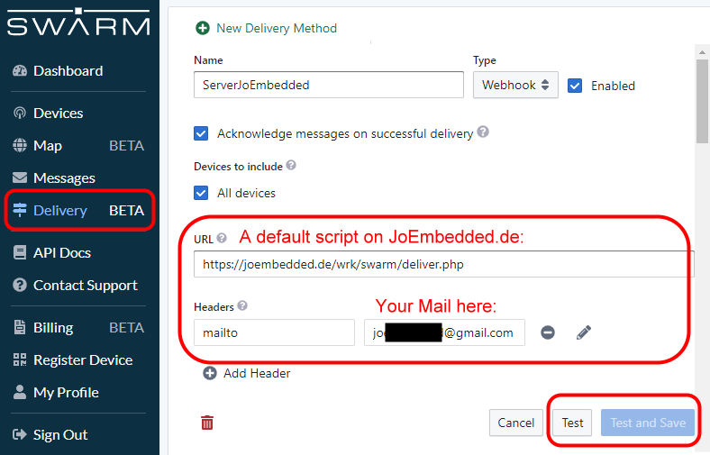

# *** PROJECT SPACEBEE ***
## A PHP-Webhook - (C)JoEmbedded.de


### How to send a simple message with the SparkFun M138 GUI:

* Check, if at least Date/Time is valid (from GPS)
* Recommended: set Receiver Test to 1 -  secs

Send the message: 
```TD "Can you hear me, Major Tom?"```

## How to forward incomming messages via Webhook:

### Setup the Webhook:

'Test' sends a dummy message. 

### A nice gimmick:

If the message starts with '!', followed by a valid mailaddress and a space character, the text after the space (and only the text) is also sent to this mailaddress.
So e.g. ```TD "!joembedded@gmail.com Can you hear me, Jo?"``` will send it to me ;-)

***


