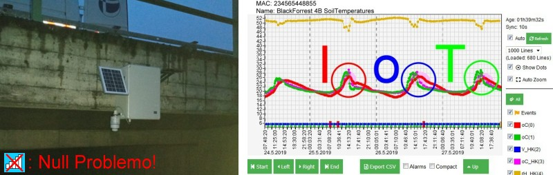

# *** PROJEKT SPACEBEE ***
## A PHP Webhook for SWARM IoT Satellites


This repository contains a webhook in PHP for the satellite IoT of SWARM (https://swarm.space). With SWARM, messages can be sent and received worldwide via satellite in the simplest way!

SWARM operates a network of currently (09/2022) about 150 small satellites in low earth orbit of about 500-600km height. The speed of these "LEO" satellites (for "Low-Earth-Orbit") is about 7.5 km/sec 
and thus almost 22 times the speed of sound! One orbit around the earth takes about 90 minutes. The naming is figurative: 
the satellites all bear the name "Spacebee-xx". The Spacebees fly uncontrolled and the orbits associate the image of a swarm with "Hive" as designation of their Server.

Sparkfun offers an Eval kit, which also contains the necessary software to communicate with the M138 modem (https://www.sparkfun.com/products/19236). 
The first 50 messages are free! After that, there is a charge of 5 US$/month for a maximum of 750 messages (max. 192 bytes each). 
In total, that is 140 kB (as of 09/2022)! Downlink (messages to the modem) is also possible, but only if the SWARM server knows the GPS data of the modem.

To transport the data from the SWARM server, Webhooks are an easy and fast way. This is a simple demo implementation in PHP (sole sourcecode 'deliver.php'). 
All incoming messages are forwarded as mail to the specified address.

***
## Getting started with the Eval-Kit in a nutshell


_Assembled Eval kit. A large ground plane and a matched antenna is absolutely important!_


_Back side of the Eval kit_


The Sparkfun carrier board basically only contains a USB COM port driver, a mPCI52 socket for the M138 modem and a USB-C socket, groundplane and antennas. The modem requires current peaks of max. 1 ampere @ 3-5 volts, 
so it is recommended to use a USB3 hub with an external power supply. 
The external power supply also has the advantage that the PC can be switched off separately from the modem (and modem meanwhile still running).

The GPS antenna supplied should be fixed (as in the picture) a few cm above the carrier plate. 

The optimal place to operate the modem is outdoors, with as clear an all-round view of the sky as possible and no objects within a radius of about 1 metre around the antenna. 
But in tests, the transmission worked even in the office when the modem was directly next to a large window area, it just took longer...

After registering on the SWARM Hive (https://bumblebee.Hive.swarm.space ), the modem must be registered via QR code. The easiest way to do this is by smartphone.

The commands of the modem are simple and can be sent very easily with the SparkFun M138 GUI.

The M138 modem contain 3 very bright LEDs: 
- &#128308; Red will be blinking after Power On until at least a valid GPS time is found,
- &#128994; Green flashes all few seconds and 
- &#128309; Blue signals satellite activity.

It is advisable to set the "Receive Test" to e.g. 10 seconds. During this time, the modem continuously displays the noise floor or detected satellites. 
After Power On, it takes a while (approx. 15 - 120 seconds) until the GPS of the modem could receive the time from GPS. Only when the modem's time is valid, messages will be accepted. 
After another (max. 10 minutes), the GPS should also know the position. Important: For messages, the position at the time of entry (not at the time of transmission) is used.
However, all messages entered are stored on the modem in a non-volatile (NV) memory (for 2 days by default). Therefore, you can e.g. enter the messages in the office and 
then bring the modem (e.g. with a USB power supply) outdoors and wait. With a running PC in the direct proximity, the noise floor is often higher than -90 dBm and thus too high,
but even a few metres away from "interferers" is quite sufficient to reach top values (below -100 dBm), even in urban areas. 

Tests have shown, that BluetoothLE has no significant influence to the noisefloor. For a BluetoothLE based gateway (based on the Open-SDI12-Blue project (https://github.com/joembedded/Open-SDI12-Blue)) see below.

As a rule, it does not take long for satellites to come within range (on average, about 15-60 minutes max.). For the "impatient", SWARM offers the tool Pass-Checker (https://kube.tools.swarm.space), 
but since the orbital data of almost all satellites are public, there are many other visualisation tools available on the internet (e.g. https://www.n2yo.com, https://satellitetracker.net/ etc.). 
Tip: search for satellite names "Spacebee-xx").

The distance range of SWARM data transmission is incredible impressive: Under good conditions, the modem can track a Spacbee for up to about 8 minutes. In this time, the satellite has moved almost 4000 km! 
Communication takes place in the VHF band at about 140 MHz @ 1 Watt TX power and a LoRa-based transmission system is used. Remember: a large ground plane and a matched antenna is absolutely important!

A maximum of 90 minutes (but usually much faster) after a Spacbee has received a message from the modem, it is sent to the Hive via a (receiving) ground station. 
A test measurement for 40 messages, from the point of measurement to arrival in the hive is in ['img/Traveltimes.png'](./img/Traveltimes.png) (measured at 49° latitude).

For the downlink, i.e. data from the Hive to the modem, the Hive uses the (known) GPS position of the modem to transmit to one of the next passing Spacbee. Therefore, this can sometimes take a little longer 
(often in the range of 2-12 hours). But uplink is the more important direction anyway.


### How to send a simple message with the SparkFun M138 GUI:

* Check, if at least Date/Time is valid (from GPS) (```DT @``` should return a value)
* Recommended: set Receiver Test to e.g. 10 secs with ```RT 10``` (Setting stored in NV memory)
* Send the message (add it to transmit queque in NV memory): ```TD "Can you hear me, Major Tom?"```
* Wait for arrival...

## How to forward incomming messages via Webhook:

### Setup the Webhook:


_'Test' sends a dummy message_

### A nice gimmick:

If the message starts with '!', followed by a valid mailaddress and a space character, the text after the space (and only the text) is also sent to this mailaddress.
So e.g. ```TD "!joembedded@gmail.com Can you hear me, Jo?"``` will send it to me ;-)

### Next step:

## Terratransfer Aquatos LEO Bee - IoT-Satellite gateway for the Nowhere
### With SDI-12-Interface and BluetoothLE

This is a real world solution for up to 50 sensors, connected via SDI-12 (LowVoltage). Local access for setup via BluetoothLE!


_'Aquatos LEO Bee inside' (available as commercial system from TerraTransfer GmbH)_


* Based on the Open-SDI12-Blue project (https://github.com/joembedded/Open-SDI12-Blue). 
* The Open-SDI12-Blue project already was ported to many meteorolgical and hydrological sensors
* Almost ALL SDI-12 sensors on the market with a low supply voltage can be connected!
* Docu will follow soon...


_'Aquatos LEO Bee' includes a free license (commecial use included) for the 'LTX Microcloud'!_



Link: [LTX Microcloud](https://github.com/joembedded/LTX_server)

***

# Sponsors
## This project was sponsered and supported by:


Link: [TerraTransfer GmbH, Bochum, Germany](https://www.terratransfer.org)

***


